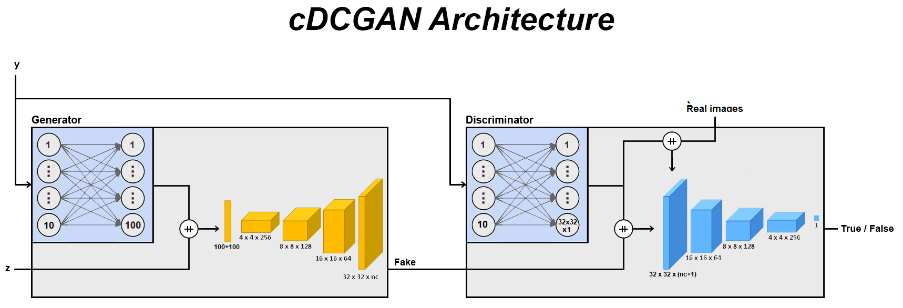
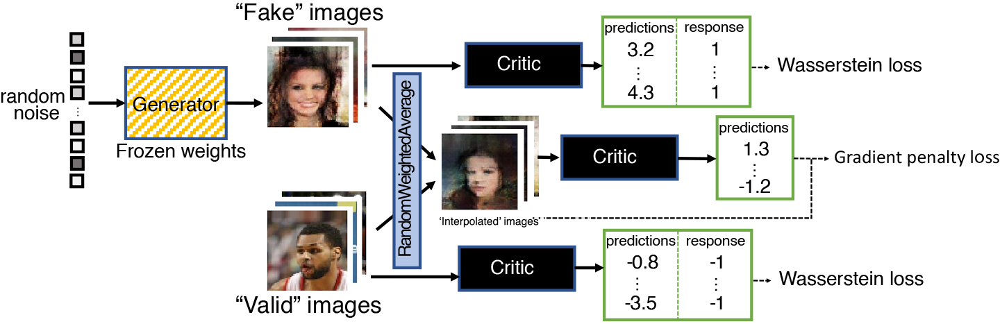

# cWGAN-gp
Pytorch implementation of cWGAN-gp. Simply my <a href="https://github.com/NicelyCla/cDCGAN">cDCGAN</a>-based but using the Wasserstein Loss and gradient penalty. 
This was used as a comparison with our meta-DCGAN-{1,2} MLP and meta-WGAN-gp 2MLP architectures 
## Architecture

